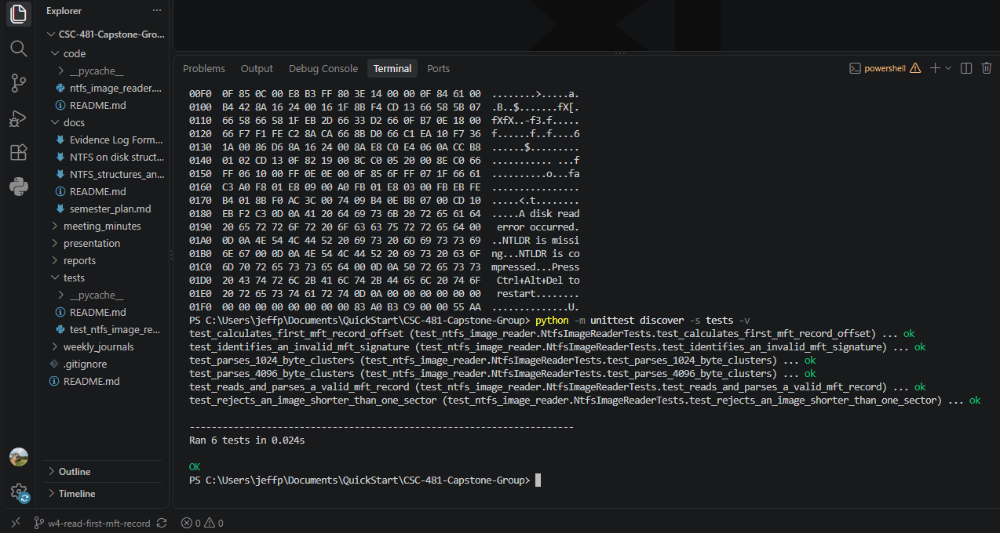

# Week 4 Team Progress Report — Draft

**Reporting period:** September 7 - September 13, 2026  
**Team:** Lucas Curtis and Jeff Perez  
**Status:** Draft — complete Lucas's marked sections before submission.

## Milestones achieved

### Read and validate the first MFT record

Jeff extended the read-only NTFS disk-image reader to locate, read, and validate MFT record 0 (`$Mft`). The program uses the boot-sector values to calculate the MFT byte offset:

```text
MFT start LCN × bytes per cluster
2005 × 1024 = 2,053,120
```

It reads the 1,024-byte MFT record at that offset and checks its `FILE` signature. The program also reports the first attribute offset, whether the record is in use, and whether it is a directory.

### Lucas's Week 4 milestone

> **[Lucas: Add the Week 4 milestone(s) you completed, including a short description of the controlled test environment, evidence work, research, or other project contribution.]**

## Subtasks completed

| Team member | Subtask | Brief description |
|---|---|---|
| Jeff Perez | MFT record reader | Extended the NTFS reader to calculate the MFT location from the boot sector and read record 0 (`$Mft`) without modifying the image. |
| Jeff Perez | MFT header validation | Added parsing for the `FILE` record signature, first attribute offset, in-use flag, and directory flag. |
| Jeff Perez | Automated tests | Added three MFT-reader tests; the full test suite now has six passing tests. |
| Lucas Curtis | Created a Baseline NTFS Image. | Used VirtualBox to create a clean NTFS partition and then pulled that and made it a .dd file. |
| Lucas Curtis | Recorded and logged the baseline | Found and recorded the hash for the .dd file and recorded all baseline information. |

## Test results and demo evidence

### Test 1: Read the first MFT record from the controlled image

**Input:** `7-ntfs-undel.dd` controlled NTFS disk image  
**Expected:** The program should use the NTFS boot-sector values to find MFT record 0, read a complete 1,024-byte record, and validate its `FILE` header.  
**Result:** Passed.

The program reported:

```text
MFT start LCN:        2005
Bytes per cluster:    1024

First MFT record summary
  Record number:        0 ($Mft)
  Byte offset:          2053120
  Record size:          1024 bytes
  Record signature:     FILE
  FILE signature valid: True
  First attribute:      byte 56
  Record in use:        True
  Is directory:         False
```

**Demo screenshot — successful MFT record read**


### Test 2: Automated parser tests

**Expected:** The program should calculate the MFT offset correctly, read and parse a valid MFT record, identify an invalid `FILE` signature, handle valid cluster sizes, and reject an image shorter than one sector.  
**Result:** Passed — 6 of 6 tests passed.

```text
test_calculates_first_mft_record_offset ... ok
test_identifies_an_invalid_mft_signature ... ok
test_parses_1024_byte_clusters ... ok
test_parses_4096_byte_clusters ... ok
test_reads_and_parses_a_valid_mft_record ... ok
test_rejects_an_image_shorter_than_one_sector ... ok

Ran 6 tests
OK
```

**Demo screenshot — automated test results**



### Test 3: Lucas's Week 4 test or evidence

> **[Lucas: Describe one completed test or documented evidence item. State the input, expected result, actual result, and add a screenshot.]**

## Lessons learned

- The MFT is NTFS's central record system for files, folders, and NTFS metadata files.
- The boot sector provides the MFT start LCN and cluster size needed to calculate an exact byte offset.
- `FILE` identifies an MFT record header; it is not the signature at the beginning of every ordinary file's contents.
- MFT record 0 (`$Mft`) is an active NTFS metadata record, and its attributes begin after the record header.
- **[Lucas: Add lessons learned from your Week 4 work.]**

## Contribution of each team member

| Team member | Contribution this week |
|---|---|
| Jeff Perez | Implemented and tested the first-MFT-record reader; ran it against the controlled NTFS image; captured program and test-result screenshots; completed a Week 4 individual journal. |
| Lucas Curtis | Created Baseling image and a clean .dd file for a baseline and testing purposes; recorded all ionforation about the .dd file; recorded the SHA256 hash; completed weeek 4 journal and meged all work to the main branch. |

## Progress compared with the project plan

The team progressed from reading the NTFS boot sector to reading and validating the first MFT record. This follows the planned incremental approach: use the boot sector to locate the MFT, then build toward parsing MFT attributes.

**[Lucas: Note any adjustment made to the plan or confirm that the team is on schedule.]**

## Plan for Week 5

- Parse and identify the first MFT attribute type.
- Continue controlled-image testing and record expected versus actual results.
- **[Lucas: Add the next Week 5 task(s) you will own.]**
