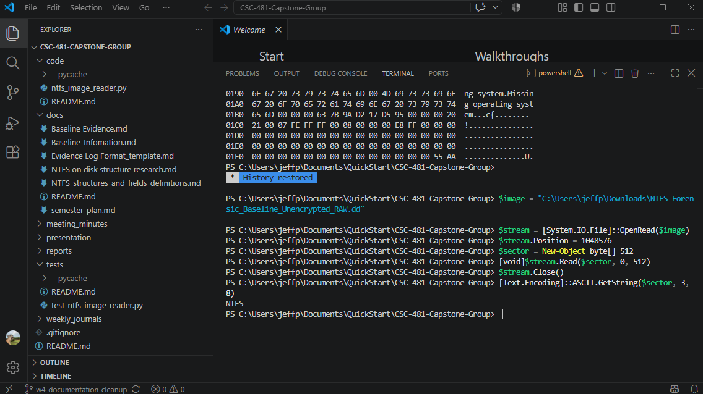
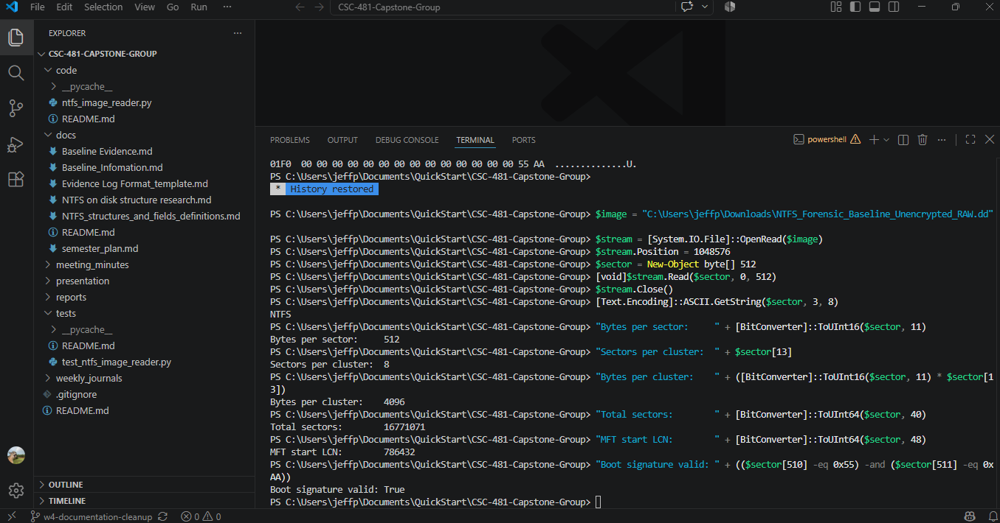
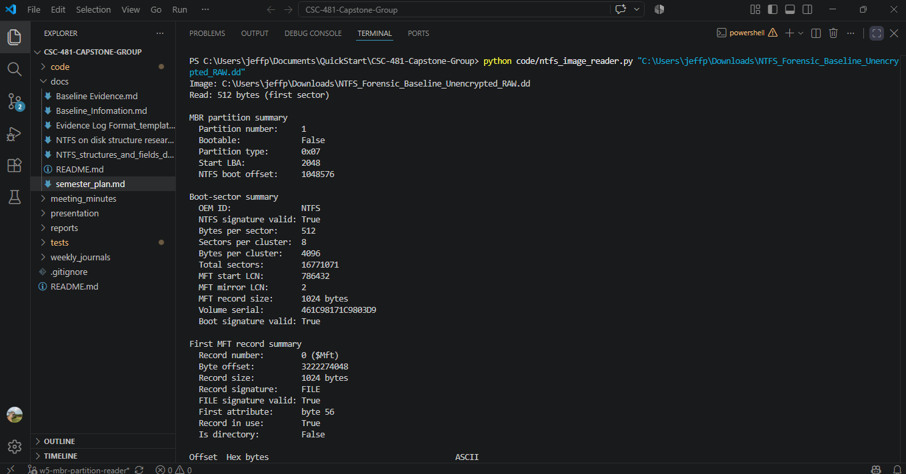
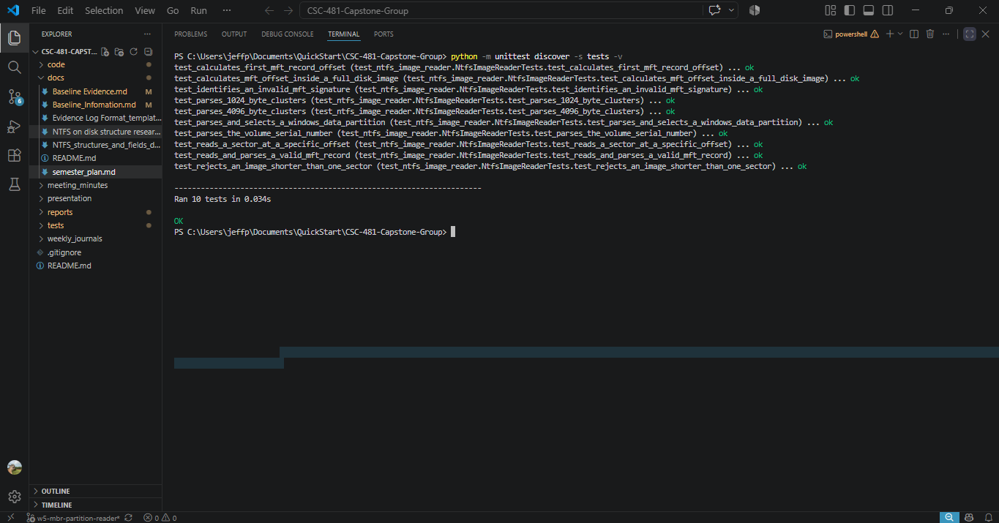

# Week 5 Team Progress Report

**Reporting period:** September 14 - September 20, 2026  
**Team:** Lucas Curtis and Jeff Perez  
**Status:** Draft; complete the Friday meeting summary and Lucas’s contribution
before submission.

## Milestones achieved

### Validated an unencrypted NTFS baseline image

The team resolved the baseline-image issue discovered during validation. The
earlier full-disk raw image had a BitLocker header at the target partition, so
it could not be used for the project’s raw NTFS/MFT parsing work. Lucas
recreated the baseline image with BitLocker disabled and shared a new 8 GiB RAW
image. Jeff independently calculated a SHA-256 hash matching Lucas’s provided
value.

### Read an MFT record from a full-disk image

Jeff extended the read-only parser to recognize an MBR, locate the Windows data
partition, verify the NTFS boot sector at the partition offset, calculate the
absolute `$Mft` location, and read MFT record 0. This is an adjustment to the
planned workflow because the team’s controlled image is a full-disk image,
rather than an image that begins directly with an NTFS volume.

## Subtasks completed

| Team member | Subtask | Brief description |
|---|---|---|
| Jeff Perez | MBR partition parser | Added parsing for populated MBR partition entries and selection of the first `0x07` Windows data partition. |
| Jeff Perez | Offset-based sector reader | Added a read-only function that reads a sector at a specified byte offset. |
| Jeff Perez | Full-disk MFT calculation | Added the NTFS partition offset to the MFT’s volume-relative location before reading MFT record 0. |
| Jeff Perez | Automated tests | Added tests for MBR partition parsing, reading at a byte offset, calculating an absolute MFT offset, and decoding the volume serial number. The suite has 10 passing tests. |
| Lucas Curtis | Baseline-image remediation | **[Lucas: confirm the image-creation steps and add your specific contribution.]** |
| Lucas Curtis | Image transfer and integrity information | **[Lucas: confirm the transfer method and any creation/verification details you performed.]** |

## Test results and demo evidence

### Test 1: Manually verify the NTFS partition boot sector

**Input:** `NTFS_Forensic_Baseline_Unencrypted_RAW.dd` at the partition start
offset identified from its MBR: 1,048,576 bytes.  
**Expected:** The sector should identify itself as NTFS and contain valid NTFS
boot-sector values.  
**Result:** Passed.

The manual read returned the `NTFS` identifier. The follow-up field check
reported 512 bytes per sector, 8 sectors per cluster, 4,096 bytes per cluster,
MFT start LCN 786,432, and a valid `55 AA` boot signature.

**Demo screenshots — manual partition and boot-sector validation**





### Test 2: Parse the full-disk MBR and read MFT record 0

**Input:** `NTFS_Forensic_Baseline_Unencrypted_RAW.dd`, an 8 GiB controlled
full-disk RAW image.  
**Expected:** The reader should identify the target MBR partition, verify the
NTFS boot sector at that partition’s offset, calculate the absolute MFT record
0 location, and validate the `FILE` record header.  
**Result:** Passed.

```text
Partition type:       0x07
Start LBA:            2048
NTFS boot offset:     1048576
NTFS signature valid: True
Boot signature valid: True
Bytes per cluster:    4096
MFT start LCN:        786432
Byte offset:          3222274048
FILE signature valid: True
Volume serial:        461C98171C9803D9
```

**Demo screenshot — successful full-disk MFT reader run**



### Test 3: Automated reader tests

**Expected:** The reader should continue to parse volume-only images, reject an
incomplete sector, validate MFT headers, parse an MBR partition, read a sector
at an offset, calculate the absolute MFT offset in a full-disk image, and
decode an NTFS volume serial number.  
**Result:** Passed; 10 of 10 tests passed.

```text
test_calculates_first_mft_record_offset ... ok
test_calculates_mft_offset_inside_a_full_disk_image ... ok
test_identifies_an_invalid_mft_signature ... ok
test_parses_1024_byte_clusters ... ok
test_parses_4096_byte_clusters ... ok
test_parses_and_selects_a_windows_data_partition ... ok
test_parses_the_volume_serial_number ... ok
test_reads_a_sector_at_a_specific_offset ... ok
test_reads_and_parses_a_valid_mft_record ... ok
test_rejects_an_image_shorter_than_one_sector ... ok

Ran 10 tests
OK
```

**Demo screenshot — automated test results**



### Test 4: SHA-256 integrity verification

**Expected:** Jeff’s calculated SHA-256 hash should match the hash supplied for
the unencrypted RAW image.  
**Result:** Passed.

```text
EFA4CA3DFA0127F7634EE71D59629A565DCEABB93B23A4A135C5B7AB84AE5E91
```

The evidence log distinguishes this validated unencrypted image from the
earlier BitLocker-protected image.

## Lessons learned

- A full-disk image begins with partition information, not necessarily an NTFS
  boot sector.
- An MBR partition type (`0x07`) is a useful clue, but the program must still
  verify the NTFS boot-sector identifier and boot signature.
- An MFT location from the NTFS boot sector is relative to the NTFS volume; a
  full-disk parser must add the partition’s starting offset.
- Hash verification proves that two copies match, while filesystem validation
  establishes whether the image can support the intended analysis.

## Contribution of each team member

| Team member | Contribution this week |
|---|---|
| Jeff Perez | Implemented and tested the MBR/partition-aware reader; verified the unencrypted image’s MBR, NTFS boot sector, and MFT record 0; independently verified the SHA-256 hash; prepared evidence and report material. |
| Lucas Curtis | **[Lucas: add completed image-remediation, documentation, testing, and review work after the Friday meeting.]** |

## Progress compared with the project plan

The team remains on track. The Week 5 parser work now supports both
volume-only images and more realistic full-disk images. The BitLocker-protected
image was an unexpected validation result, but recreating an unencrypted
baseline resolved it without changing the project’s goals. The team will begin
the planned next milestone: parsing MFT attributes and validating known files,
during Week 6.

## Plan for Week 6

- Parse the first MFT attribute header and identify attribute types.
- Begin reading `$STANDARD_INFORMATION`, `$FILE_NAME`, and `$DATA` attributes.
- Create a small known-file validation set in the controlled baseline image.
- Record tests, screenshots, contributions, and lessons learned in the weekly
  documentation.
