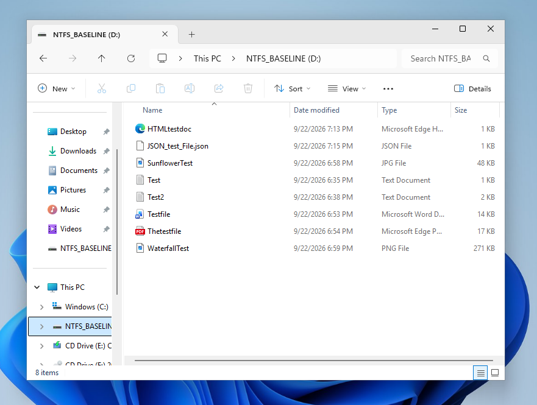
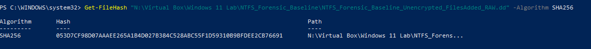
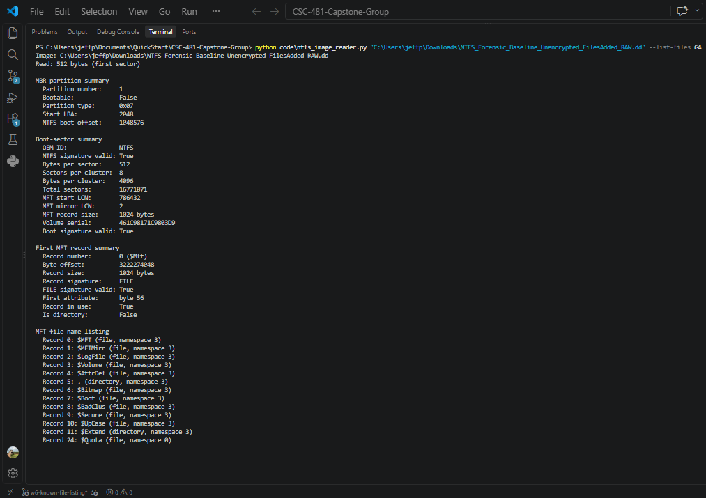
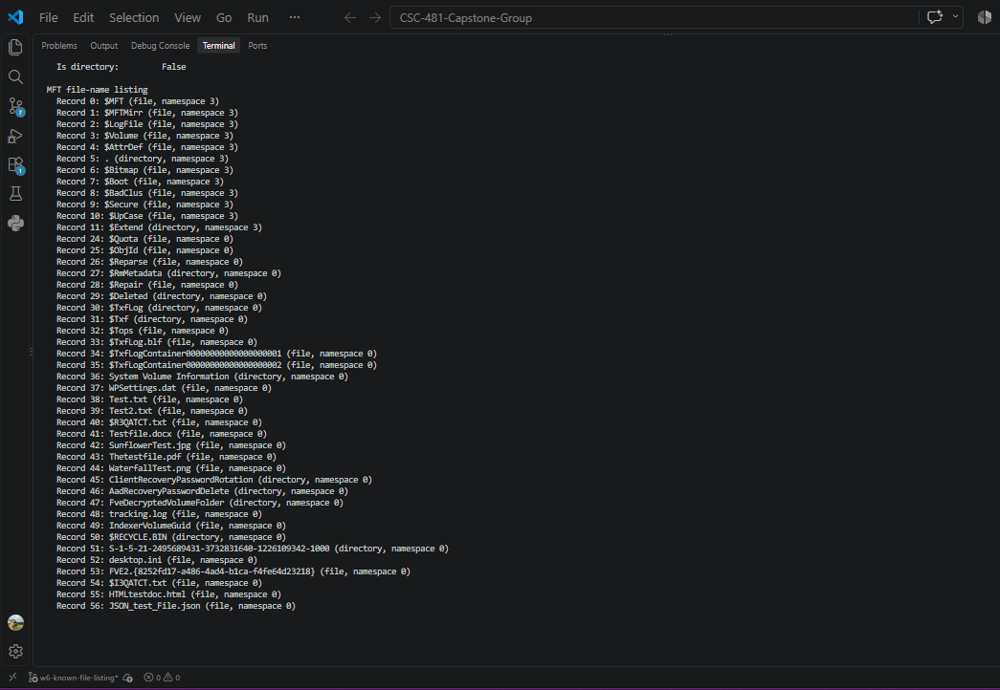
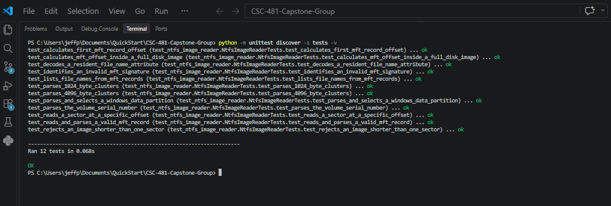

# Week 6 Team Progress Report

**Reporting period:** September 21 - September 27, 2026  
**Team:** Lucas Curtis and Jeff Perez  
**Status:** Draft through September 24; complete after the Friday summary meeting.

## Milestones achieved

### Initial MFT file-name listing

Jeff extended the read-only NTFS parser beyond boot-sector and MFT-location
validation. The reader now walks attributes in an in-use MFT record, decodes
resident `$FILE_NAME` attributes, and lists file names from a selected range of
MFT records in a full-disk image.

### Known-file validation set prepared

Lucas provided a controlled unencrypted RAW image with eight visible test files
on the dedicated NTFS baseline volume. The reader located the same eight names
in the exported image. The Milestone 3 success criterion was updated to use the
team's confirmed eight-file validation set.

## Subtasks completed

| Team member | Subtask | Brief description |
|---|---|---|
| Jeff Perez | MFT attribute walker | Added read-only logic that starts at the first-attribute offset, reads each attribute type and length, and advances safely to the next attribute. |
| Jeff Perez | `$FILE_NAME` decoder | Added UTF-16LE decoding for resident `$FILE_NAME` attributes. |
| Jeff Perez | File-name scanner | Added `--list-files RECORDS` to scan a chosen range of MFT records and list decoded file names. |
| Jeff Perez | Automated tests | Added tests for decoding a `$FILE_NAME` attribute and listing names from MFT-shaped records. The suite has 12 passing tests. |
| Jeff Perez | Real-image validation | Scanned the first 64 MFT records in Lucas's exported image and located all eight visible validation files. |
| Lucas Curtis | Known-file baseline and manifest | Created the eight visible test files in the dedicated NTFS baseline, exported the corresponding RAW image, recorded its SHA-256 hash, and prepared the known-file manifest. |

## Test results and demo evidence

### Test 1: Confirm the known files in the virtual-machine NTFS volume

**Input:** The dedicated `NTFS_BASELINE (D:)` volume in the controlled
VirtualBox guest.  
**Expected:** Eight visible validation files should be present before the RAW
image is exported.  
**Result:** Passed. The VM screenshot shows the eight files used for validation.



### Test 2: Verify the exported image hash

**Input:** `NTFS_Forensic_Baseline_Unencrypted_FilesAdded_RAW.dd`.  
**Expected:** A SHA-256 value is recorded for the image used by the parser.  
**Result:** Passed. Lucas recorded the following SHA-256 value:

```text
053D7CF98D07AAAEE265A1B4D027B384C528ABC55F1D59310B9BFDEE2CB76691
```



### Test 3: List the known files from MFT records

**Input:** The exported 8 GiB full-disk RAW image, scanned with:

```powershell
python code\ntfs_image_reader.py "<image path>" --list-files 64
```

**Expected:** The parser should locate the eight confirmed visible file names
in in-use records with valid `FILE` signatures.  
**Result:** Passed.

| Known file | MFT record |
|---|---:|
| `Test.txt` | 38 |
| `Test2.txt` | 39 |
| `Testfile.docx` | 41 |
| `SunflowerTest.jpg` | 42 |
| `Thetestfile.pdf` | 43 |
| `WaterfallTest.png` | 44 |
| `HTMLtestdoc.html` | 55 |
| `JSON_test_File.json` | 56 |

**Demo screenshots — successful MFT file-name scan**





### Test 4: Automated reader tests

**Expected:** The parser should continue to validate boot sectors, MFT headers,
MBR partitions, offset reads, and the new file-name parsing functions.  
**Result:** Passed; 12 of 12 tests passed.

**Demo screenshot — automated test results**



## Lessons learned

- MFT attributes are variable-length structures, so a parser must use each
  attribute's recorded length rather than assume fixed positions.
- `$FILE_NAME` is stored as UTF-16LE text and can be decoded from a resident
  attribute after the parser identifies type `0x30`.
- A known-file test is stronger when the files are visible in the controlled
  source volume and their names are independently found by the parser in the
  exported image.
- A leading `$` in a file name does not by itself establish that it is a
  system file or a known validation file; the source evidence and manifest
  establish its role.

## Contribution of each team member

| Team member | Contribution this week |
|---|---|
| Jeff Perez | Implemented and tested MFT attribute walking, `$FILE_NAME` decoding, and controlled MFT record scanning; validated the eight known visible file names against the exported image; updated the Week 6 plan measurement; and prepared evidence and report material. |
| Lucas Curtis | Created the eight-file controlled validation set, exported the updated RAW image, recorded its SHA-256 hash, supplied the VM and hash evidence, prepared the manifest, and created the Week 6 meeting-minutes file. |

## Progress compared with the project plan

The team remains on track for Milestone 3. The reader now lists the eight
confirmed validation-file names from the full-disk image, which completes the
main technical objective for the week. The plan was adjusted from ten files to
eight documented files to match the controlled validation set actually created
in the VM. Before submission, the team must complete the Friday summary
meeting, finalize both journals, and change this report status to Complete.

## Plan for Week 7

- Begin the controlled ADS creation workflow.
- Extend attribute parsing to report `$STANDARD_INFORMATION`, `$FILE_NAME`, and
  `$DATA` metadata.
- Document the source image, payload preparation, tests, and evidence before
  the next weekly report.
