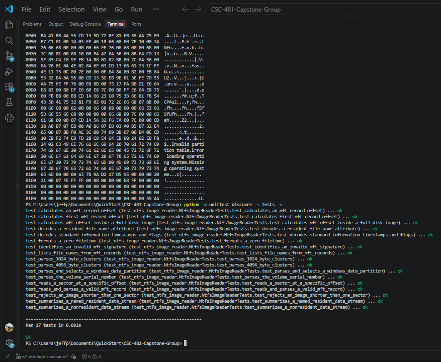
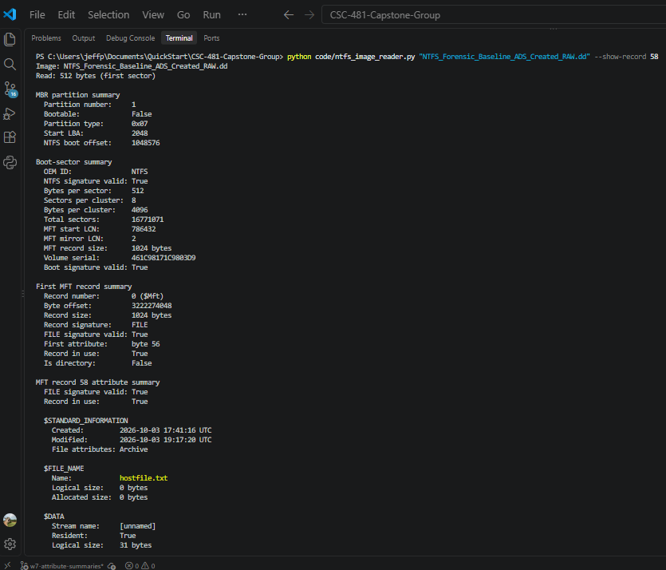
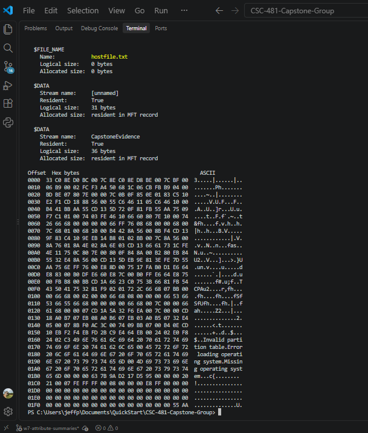
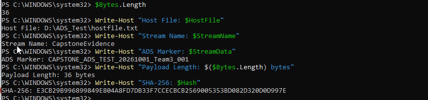
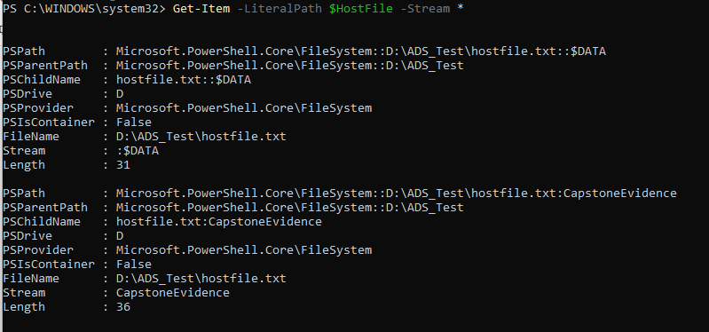
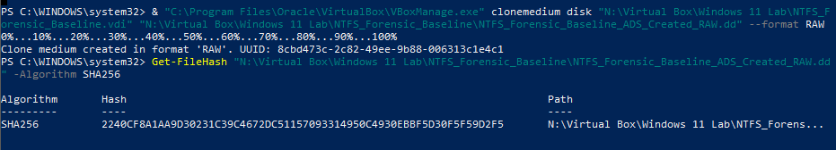

# Week 7 Team Progress Report

**Reporting period:** September 28 - October 4, 2026  
**Team:** Lucas Curtis and Jeff Perez  
**Status:** Complete

## Milestones achieved

### Attribute-parser support completed

Jeff extended the read-only NTFS parser to decode the three Milestone 4
attribute types: `$STANDARD_INFORMATION`, `$FILE_NAME`, and `$DATA`. The
output reports timestamps and flags, file names, stream names, logical and
allocated sizes, and resident/nonresident data state. The current automated
suite passes 17 of 17 tests.

### Existing named-stream recognition demonstrated

The known-file image contains `Zone.Identifier` named `$DATA` streams on the
JPG and PNG test files. The parser identifies those streams as resident data.
They are normal Windows metadata and are not counted as the team’s controlled
ADS payload.

## Subtasks completed

| Team member | Subtask | Brief description |
|---|---|---|
| Jeff Perez | Attribute parser | Added parsing and readable summaries for `$STANDARD_INFORMATION`, `$FILE_NAME`, and `$DATA`. |
| Jeff Perez | Record inspection command | Added `--show-record` to inspect selected MFT records. |
| Jeff Perez | Automated tests | Added coverage for timestamps, flags, named resident/nonresident data, record offsets, and zero FILETIME values; 17 tests pass. |
| Jeff Perez | Slack-space procedure | Documented a controlled, lab-only procedure and required evidence; no payload was embedded. |
| Lucas Curtis | Controlled ADS workflow | Created `CapstoneEvidence` on `D:\ADS_Test\hostfile.txt`; supplied marker, byte length, payload hash, source screenshots, and exported RAW image. |

## Test results and demo evidence

### Test 1: Attribute summary for known files

**Input:** The full-disk RAW image containing the eight known validation files.  
**Method:** Run `--show-record` for known file records.  
**Expected:** The parser identifies metadata, name, normal or named stream,
size, and resident/nonresident state.  
**Result:** Passed. The parser reported resident data for `Test.txt`,
`HTMLtestdoc.html`, and `JSON_test_File.json`, and nonresident data for the
larger test files. It also recognized existing `Zone.Identifier` streams.

Detailed results are recorded in
[Week 7 Attribute-Parser Validation](../docs/week7_attribute_parser_validation.md).

### Test 2: Automated parser tests

**Expected:** Existing boot-sector/MFT behavior and new attribute decoding
should pass together.  
**Result:** Passed; 17 of 17 tests passed.

### Test 3: Controlled ADS validation

**Input:** `NTFS_Forensic_Baseline_ADS_Created_RAW.dd`.  
**Method:** Independently hash the image, list MFT records, then inspect record
58 using `--show-record 58`.  
**Expected:** The image hash matches Lucas's source evidence and the parser
identifies `hostfile.txt` with the named `CapstoneEvidence` stream, 36 bytes.  
**Result:** Passed on October 3. The image SHA-256 matches Lucas's screenshot.
The parser reports resident unnamed contents of 31 bytes and resident
`CapstoneEvidence` data of 36 bytes, matching the guest-VM stream listing.
Payload extraction and a recovered-payload hash comparison remain future work.

See the [ADS payload manifest](../docs/week7_ads_payload_manifest.md) for the
marker, hashes, command, and validation details.

## Lessons learned

- `$STANDARD_INFORMATION`, `$FILE_NAME`, and `$DATA` have different forensic
  purposes and must not be treated as interchangeable sources of file details.
- A blank `$DATA` stream name means ordinary file contents; a populated stream
  name indicates ADS metadata or content.
- Resident data lives in the MFT record, while nonresident data requires data
  runs to locate clusters. Content recovery is intentionally outside the
  current metadata parser.
- Lucas learned to create an ADS manually using PowerShell, using reading and
  tutorials to complete the workflow correctly. He reported no problems.

## Contribution of each team member

| Team member | Contribution this week |
|---|---|
| Jeff Perez | Completed and tested the attribute parser, record-summary command, terminal readability update, and controlled slack-space procedure draft; documented validation results and limitations. |
| Lucas Curtis | Created the controlled ADS, recorded the marker, stream lengths and payload hash, exported the working RAW image, and supplied source evidence. |

## Progress compared with the project plan

The Week 7 attribute-parser and ADS-creation objectives are complete. On
October 3, the parser identified the controlled host file and named stream,
and the image hash matched Lucas's source evidence. Milestone 4 continues
through Week 8 with slack-space embedding and data-run support. At the
Saturday, October 3 meeting at 7:30 p.m., both members reviewed each other's
work, confirmed the parser is functional, and reported no issues. The next
planning meeting is Monday, October 5 at 7:30 p.m.

## Plan for Week 8

- Validate and document the controlled ADS workflow and image state.
- Begin the controlled slack-space test setup after team review.
- Add named-stream and nonresident-data-run support needed for later recovery.
